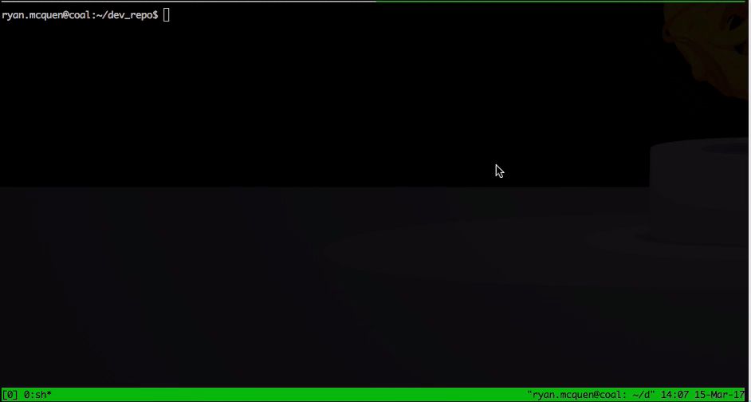

Let's say we have two repos:

```
~/live_repo
~/dev_repo
```

Run the following in the `dev` repo (this only needs to be done once):

```
git remote add live ~/live_repo
```

P.S. For remote repos use the `SSH` or `HTTPS` link.

---

Run the following in the `live` repo (this only needs to be done once):

```
git config --global receive.denyCurrentBranch ignore
```

Add the following hook to the `live` repo as `.git/hooks/post-receive` (make sure it is executable!):

```sh
#!/bin/sh
export GIT_WORK_TREE="~/live_repo"
export PERMPARAMS="www-data:www-admin"

git checkout -f
(
  cd "${GIT_WORK_TREE}"
  sudo chown "${PERMPARAMS}" . -R
  sudo find . -type d -exec chmod 775 {} \;
  sudo find . -type f -exec chmod 664 {} \;
)
```

The `chown` command will need to be modified depending on what users are present on the system. The `chmod` command is rather generic and gives all folders `775` and all files `664`. These are usually sensible defaults.

Then to deploy changes, enter the `dev` repo (`cd ~/dev_repo`) and add any files you want to _launch_ with `git`:

```
git add foo.js
```

Then to launch you must include a message prepended with `MAJOR: `, `MINOR: ` or `PATCH: `, like so:

```
./launch 'MINOR: Add foo.'
```

The repo pushes to the live server, tags the commit with a sequential release number and does any other cleanup. If you were at version `1.0.0`, the `MINOR: ` prepend would bump that to `1.1.0`.



